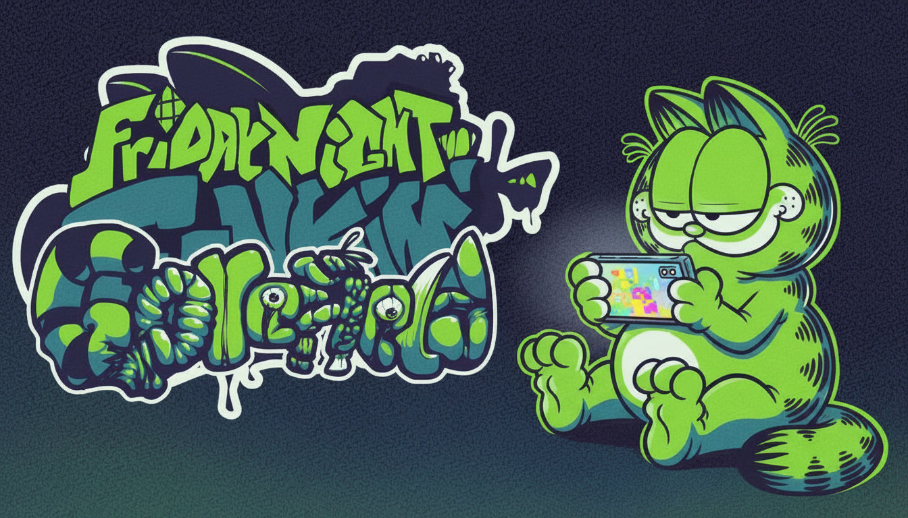

# Gorefield V2 Mobile Port!!

This is a port of the Friday Night Funkin' Gorefield V2 for mobile devices. A lot is heavily inspired by LumpyTouch's animations!

HAPPY 3ND ANNIVERSARY FROM GOREFIELD V2 MOD – MOBILE PORT OUT NOW!

The lasagna is ready… now on your mobile!

After 2 long years, the story of Jon and BF vs. Gorefield continues, with better quality and content. This mobile port brings the full experience of Gorefield V2. An adventure full of terrors and enigmas awaits you, now playable on the go!

# STUFF IN MOD
- Multiple creepy versions of Gorefield
- Shape-shifting gods and boss-like encounters
- Around 20 polished songs
- Story Mode cutscenes (and some special weeks)
- Codes menu, TV interactions, and hidden easter eggs
- Full shader support
- Middle Scroll fully adapted to all songs

# ENGINE???
this repository is based on the codename engine port by the homuhomu833 team, with the gorefield mod already included, resulting in a standalone build ready to install and play.

Download Codename:
- Windows - MacOS - Linux: [https://codename-engine.com/]
- Android - IOS: [https://github.com/HomuHomu833-haxe-stuff/CodenameEngine-Mobile/]

Codename's Github: [https://github.com/FNF-CNE-Devs/CodenameEngine]

Little note, gorefield builds on gamebanana and gamejolt are not mod zip files. they are standalone installs — apk for android and ipa for ios!!!

# Mobile Engine Credits:

- Credits to Homura for porting the engine
- Credits to Karim Akra for helping on the port
- Credits to SantiYea for bringing back the source
- Credits to TheFrost72 for porting the mod
